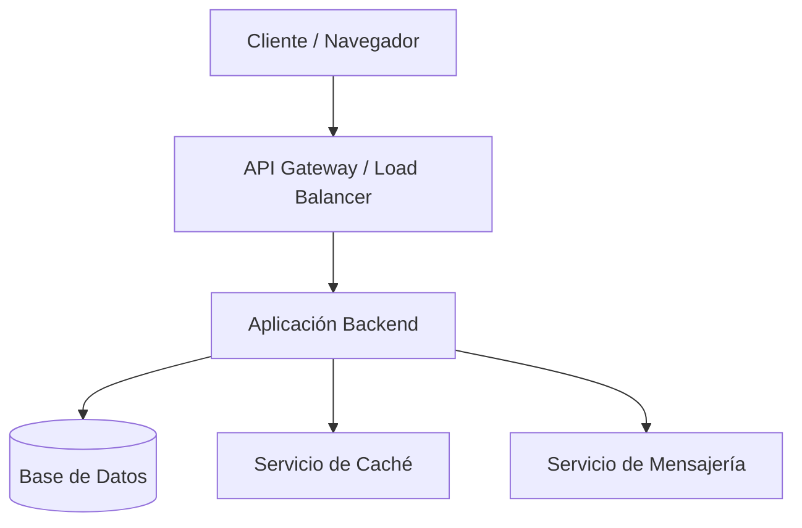

# Arquitectura del Proyecto

Este documento describe la arquitectura de alto nivel del proyecto. Actualícelo para reflejar las decisiones de diseño específicas de su implementación.

## Visión General

Describa aquí el propósito principal del sistema, sus usuarios objetivo y las principales funcionalidades que ofrece.

## Componentes Principales

Enumere y describa los componentes o módulos principales del sistema, sus responsabilidades y cómo interactúan entre sí.

## Decisiones de Arquitectura (ADRs)

Las decisiones de arquitectura relevantes se documentan en el directorio `docs/adr/`. Cada decisión sigue el formato de **Architecture Decision Record (ADR)** para mantener un historial claro de las elecciones técnicas y su justificación.

## Diagrama de Arquitectura

Incluya aquí un diagrama de arquitectura (puede usar Mermaid, Draw.io, o cualquier herramienta de su preferencia).

## Tecnologías Utilizadas

Documente aquí el stack tecnológico del proyecto, incluyendo lenguajes, frameworks, bases de datos y servicios externos.
